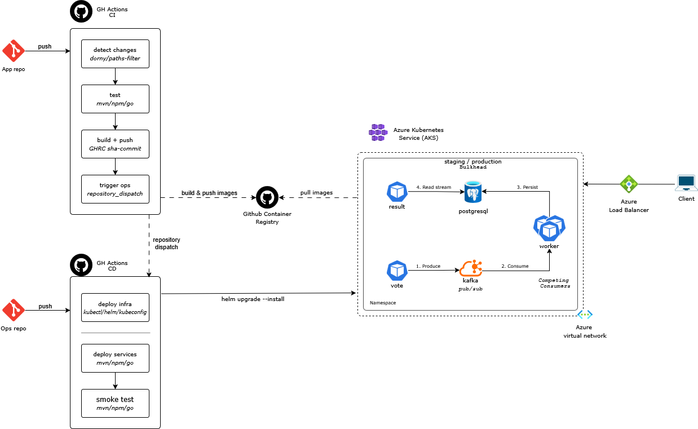

# Microservices Demo Pipeline Ops

Este repositorio centraliza la operacion y despliegue del sistema de votacion en Kubernetes.
Actua como ops-repo: recibe eventos desde app-repo y ejecuta CD hacia staging o production.

Flujo base:

- app-repo construye y publica imagenes con tag inmutable sha-commit.
- app-repo dispara ops-repo por repository_dispatch.
- ops-repo despliega con Helm segun entorno de destino.

## Arquitectura

Diagrama de referencia: 

- Compute: AKS
- Mensajeria: Kafka
- Persistencia: PostgreSQL
- Servicios desplegados: vote, result, worker

## CI/CD en 30 segundos

- Push en app-repo a develop: trigger a ops-repo con environment=staging.
- Push en app-repo a main: trigger a ops-repo con environment=production.
- ops.yml resuelve payload, valida origen y despliega chart del servicio.
- infra.yml despliega infraestructura base por branch o workflow_dispatch.

Workflows de este repo:

- [.github/workflows/ops.yml](.github/workflows/ops.yml)
- [.github/workflows/infra.yml](.github/workflows/infra.yml)

## Estrategia de ramas

Este repositorio usa Trunk-Based Development para cambios de operaciones.

- Rama permanente: main.
- Ramas cortas: fix/*, update/*, add/*.
- La rama no define el entorno de despliegue de servicios; lo define el payload entrante.

Detalle completo: [docs/branching-strategy-ops.md](docs/branching-strategy-ops.md)

## Patrones cloud implementados

Se aplican tres patrones principales:

1. Publisher Subscriber: vote publica en Kafka y worker consume asincronamente.
2. Competing Consumers: multiples replicas de worker consumen en paralelo.
3. Bulkhead: separacion por namespaces staging y production.

Detalle completo: [docs/cloud-design-patterns.md](docs/cloud-design-patterns.md)

## Infraestructura como codigo

1. Terraform para provisionamiento de recursos base.
2. Helm para despliegue de infraestructura y microservicios.

Rutas clave:

- [infrastructure/](infrastructure/)
- [infrastructure/k8s/](infrastructure/k8s/)
- [infrastructure/terraform/](infrastructure/terraform/)
- [vote/chart/](vote/chart/)
- [result/chart/](result/chart/)
- [worker/chart/](worker/chart/)

## Ejecucion operativa

Despliegue de servicio:

- Workflow: ops.yml
- Trigger principal: repository_dispatch type app-image-ready
- Alternativa manual: workflow_dispatch

Despliegue de infraestructura:

- Workflow: infra.yml
- Trigger automatico: push a develop o main con cambios en infrastructure/**
- Alternativa manual: workflow_dispatch con input environment

## Seguridad y configuracion

Secrets requeridos:

- KUBE_CONFIG_STAGING
- KUBE_CONFIG_PRODUCTION

Variables requeridas:

- APP_REPO: repositorio permitido para disparar deploys por repository_dispatch

Notas:

- ops.yml bloquea origen no esperado cuando APP_REPO esta configurado.
- El workflow soporta dry run controlado por env OPS_DRY_RUN en el archivo.

## Runbook

Guia de demo y validacion operativa: [demo-runbook.md](demo-runbook.md)
